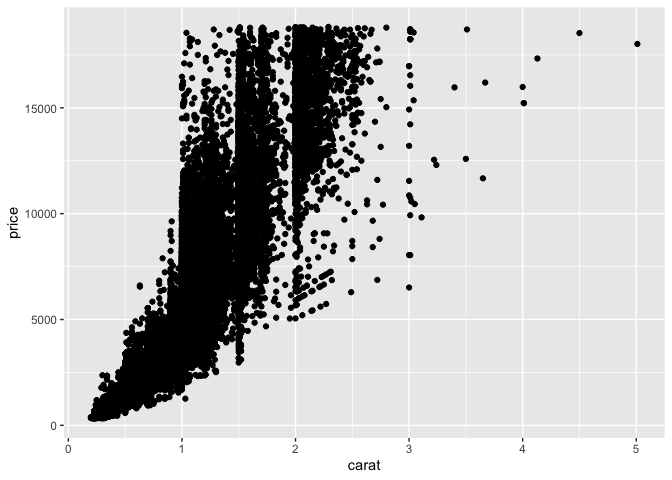
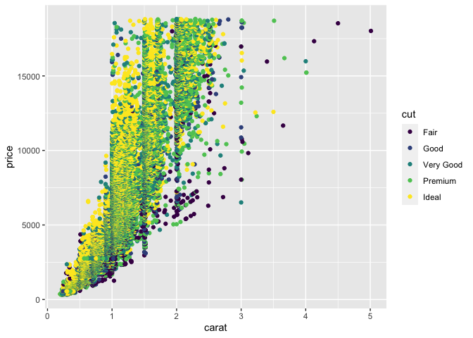

Data Visualization Basics
================
Zach del Rosario
2020-05-03

*Purpose*: The most powerful way for us to learn about a dataset is to
*visualize the data*. Throughout this class we will make extensive use
of the *grammar of graphics*, a powerful graphical programming *grammar*
that will allow us to create just about any graph you can imagine\!

*Reading*: [Data Visualization
Basics](https://rstudio.cloud/learn/primers/1.1). *Note*: In RStudio use
`Ctrl + Click` (Mac `Command + Click`) to follow the link. *Topics*:
`Welcome`, `A code template`, `Aesthetic mappings`. *Reading Time*: \~
30 minutes

**q1** Load the `tidyverse` and inspect the `diamonds` dataset. What do
the `cut`, `color`, and `clarity` variables mean?

Answer: Cut, color, and clarity are attributes of diamonds.

*Hint*: We learned how to inspect a dataset in `e-data-00-basics`\!

``` r
library(tidyverse)
```

    ## ── Attaching packages ────────────────────────────────────────────────────────────────────── tidyverse 1.3.0 ──

    ## ✓ ggplot2 3.3.2     ✓ purrr   0.3.4
    ## ✓ tibble  3.0.2     ✓ dplyr   1.0.0
    ## ✓ tidyr   1.1.0     ✓ stringr 1.4.0
    ## ✓ readr   1.3.1     ✓ forcats 0.5.0

    ## ── Conflicts ───────────────────────────────────────────────────────────────────────── tidyverse_conflicts() ──
    ## x dplyr::filter() masks stats::filter()
    ## x dplyr::lag()    masks stats::lag()

``` r
head(diamonds)
```

    ## # A tibble: 6 x 10
    ##   carat cut       color clarity depth table price     x     y     z
    ##   <dbl> <ord>     <ord> <ord>   <dbl> <dbl> <int> <dbl> <dbl> <dbl>
    ## 1 0.23  Ideal     E     SI2      61.5    55   326  3.95  3.98  2.43
    ## 2 0.21  Premium   E     SI1      59.8    61   326  3.89  3.84  2.31
    ## 3 0.23  Good      E     VS1      56.9    65   327  4.05  4.07  2.31
    ## 4 0.290 Premium   I     VS2      62.4    58   334  4.2   4.23  2.63
    ## 5 0.31  Good      J     SI2      63.3    58   335  4.34  4.35  2.75
    ## 6 0.24  Very Good J     VVS2     62.8    57   336  3.94  3.96  2.48

**q2** Use your “standard checks” to determine what variables the
dataset has.

Answer: carat <dbl> cut <ord> color <ord> clarity <ord> depth <dbl>
table <dbl> price <int> x <dbl> y <dbl> z

Now that we have the list of variables in the dataset, we know what we
can visualize\!

**q3** Using `ggplot`, visualize `price` vs `carat` with points. What
trend do you observe?

*Hint*: Usually the language `y` vs `x` refers to the `vertical axis` vs
`horizontal axis`. This is the opposite order from the way we often
specify `x, y` pairs. Language is hard\!

``` r
## TODO: Complete this code
ggplot(data = diamonds) +
  geom_point(aes(x = carat, y = price))
```

<!-- -->

**Observations**:

Answer: The trend that I observe is that price goes up as carat goes up.

**q4** Create a new graph to visualize `price`, `carat`, and `cut`
simultaneously.

*Hint*: Remember that you can add additional aesthetic mappings in
`aes()`. Some options include `size`, `color`, and `shape`.

``` r
## TODO: Complete this code
ggplot(data = diamonds) +
  geom_point(aes(x = carat, y = price, color = cut))
```

<!-- -->

**Observations**:

I tried a lot of different combinations and had a hard time making a
visually meaningful graph. One interesting thing I see from this one is
that there are some fair cut diamonds that are still at a high price due
to their carat size.

<!-- include-exit-ticket -->

# Exit Ticket

<!-- -------------------------------------------------- -->

Once you have completed this exercise, make sure to fill out the **exit
ticket survey**, [linked
here](https://docs.google.com/forms/d/e/1FAIpQLSeuq2LFIwWcm05e8-JU84A3irdEL7JkXhMq5Xtoalib36LFHw/viewform?usp=pp_url&entry.693978880=e-code-target).
