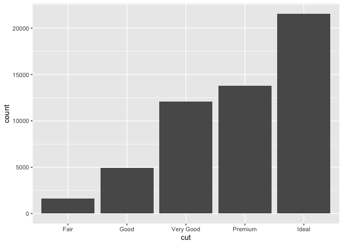
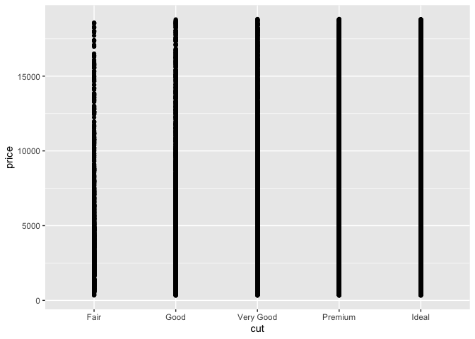
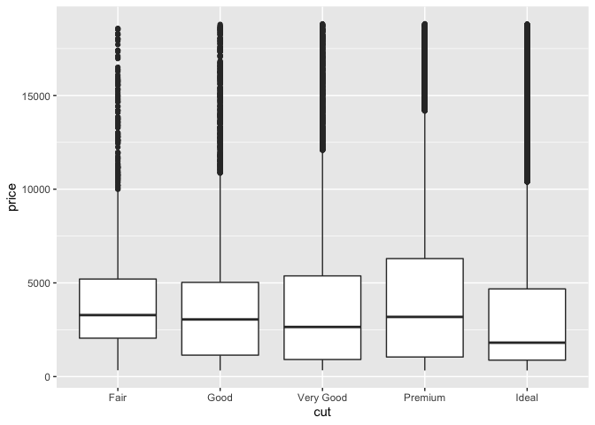
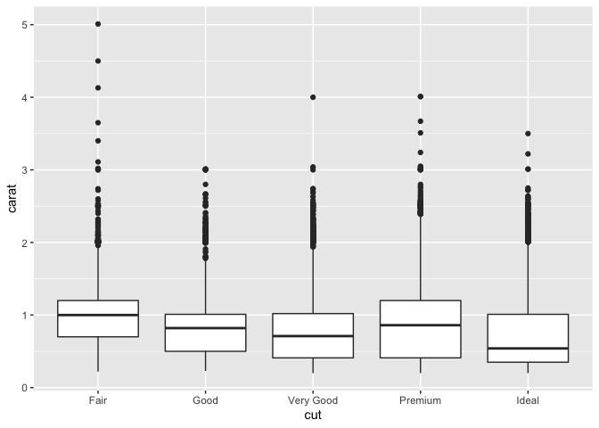

EDA Basics
================
2020-05-07

*Purpose*: *Exploratory Data Analysis* (EDA) is a **crucial** skill for
a practicing data scientist. Unfortunately, much like human-centered
design EDA is hard to teach. This is because EDA is **not** a strict
procedure, so much as it is a **mindset**. Also, much like
human-centered design, EDA is an *iterative, nonlinear process*. There
are two key principles to keep in mind when doing EDA:

  - 1.  Curiosity: Generate lots of ideas and hypotheses about your
        data.

  - 2.  Skepticism: Remain unconvinced of those ideas, unless you can
        find credible patterns to support them.

Since EDA is both *crucial* and *difficult*, we will practice doing EDA
*a lot* in this course\!

*Reading*: [Exploratory Data
Analysis](https://rstudio.cloud/learn/primers/3.1) *Topics*: (All
topics) *Reading Time*: \~45 minutes

*Note*: This exercise will consist of interpreting pre-made graphs. You
can run the whole notebook to generate all the figures at once. Just
make sure to do all the exercises and write your observations\!

``` r
library(tidyverse)
```

    ## ── Attaching packages ───────────────────────── tidyverse 1.3.0 ──

    ## ✓ ggplot2 3.3.2     ✓ purrr   0.3.4
    ## ✓ tibble  3.0.2     ✓ dplyr   1.0.0
    ## ✓ tidyr   1.1.0     ✓ stringr 1.4.0
    ## ✓ readr   1.3.1     ✓ forcats 0.5.0

    ## ── Conflicts ──────────────────────────── tidyverse_conflicts() ──
    ## x dplyr::filter() masks stats::filter()
    ## x dplyr::lag()    masks stats::lag()

**q0** Remember from `e02-data-basics` there were *simple checks* we’re
supposed to do? Do those simple checks on the diamonds dataset below.

``` r
library(tidyverse)
glimpse(diamonds)
```

    ## Rows: 53,940
    ## Columns: 10
    ## $ carat   <dbl> 0.23, 0.21, 0.23, 0.29, 0.31, 0.24, 0.24, 0.26, 0.22, 0.23, 0…
    ## $ cut     <ord> Ideal, Premium, Good, Premium, Good, Very Good, Very Good, Ve…
    ## $ color   <ord> E, E, E, I, J, J, I, H, E, H, J, J, F, J, E, E, I, J, J, J, I…
    ## $ clarity <ord> SI2, SI1, VS1, VS2, SI2, VVS2, VVS1, SI1, VS2, VS1, SI1, VS1,…
    ## $ depth   <dbl> 61.5, 59.8, 56.9, 62.4, 63.3, 62.8, 62.3, 61.9, 65.1, 59.4, 6…
    ## $ table   <dbl> 55, 61, 65, 58, 58, 57, 57, 55, 61, 61, 55, 56, 61, 54, 62, 5…
    ## $ price   <int> 326, 326, 327, 334, 335, 336, 336, 337, 337, 338, 339, 340, 3…
    ## $ x       <dbl> 3.95, 3.89, 4.05, 4.20, 4.34, 3.94, 3.95, 4.07, 3.87, 4.00, 4…
    ## $ y       <dbl> 3.98, 3.84, 4.07, 4.23, 4.35, 3.96, 3.98, 4.11, 3.78, 4.05, 4…
    ## $ z       <dbl> 2.43, 2.31, 2.31, 2.63, 2.75, 2.48, 2.47, 2.53, 2.49, 2.39, 2…

I’m going to walk you through a train of thought I had when studying the
diamonds dataset.

There are four standard “C’s” of
[judging](https://en.wikipedia.org/wiki/Diamond_\(gemstone\)) a
diamond.\[1\] These are `carat, cut, color` and `clarity`, all of which
are in the `diamonds` dataset.

### Hypothesis 1

**Here’s a hypothesis**: `Ideal` is the “best” value of `cut` for a
diamond. Since an `Ideal` cut seems more labor-intensive, I hypothesize
that `Ideal` cut diamonds are less numerous than other cuts.

**q1** Run the chunk below, and study the plot. Was hypothesis 1
correct? Why or why not?

``` r
diamonds %>%
  ggplot(aes(cut)) +
  geom_bar()
```

<!-- -->

**Observations**:

Ideal cut diamonds are actually the most numerous in this dataset.

### Hypothesis 2

**Another hypothesis**: The `Ideal` cut diamonds should be the most
pricey.

**q2.1** Study the following graph; does it support, contradict, or not
relate to hypothesis 2?

*Hint*: Is this an effective graph? Why or why not?

``` r
diamonds %>%
  ggplot(aes(cut, price)) +
  geom_point()
```

<!-- -->

**Observations**: This graph does not provide much useful information
for testing the hypothesis that ideal cut diamonds are the most pricey.

**q2.2** Study the following graph; does it support or contradict
hypothesis 2?

``` r
diamonds %>%
  ggplot(aes(cut, price)) +
  geom_boxplot()
```

<!-- -->

**Observations**: According to the graph, ideal cut diamonds tend to be
the least pricey.

### Unraveling Hypothesis 2

Upon making the graph in **q2.2**, I was very surprised. So I did some
reading on diamond cuts. It turns out that some gemcutters [sacrifice
cut for carat](https://en.wikipedia.org/wiki/Diamond_\(gemstone\)#Cut).
Could this effect explain the surprising pattern above?

**q3** Study the following graph; does it support a “carat over cut”
hypothesis? How might this relate to price?

*Hint*: The article linked above will help you answer these questions\!

``` r
diamonds %>%
  ggplot(aes(cut, carat)) +
  geom_boxplot()
```

<!-- -->

**Observations**:

The largest carat size tends to be of fair cut. This would support the
hypothesis of carat over cut.

### Footnotes

\[1\] Don’t mistake my focus on `diamonds` as an endorsement of the
diamond industry. In my opinion aesthetic diamonds are a morally dubious
scam.

<!-- include-exit-ticket -->
